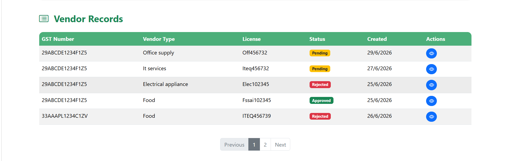

<div align="center">


# VendorFlow

### Vendor Management System

<p>
A web-based application for managing vendor registration, verification,
approval, and administration through a centralized workflow.
</p>

<p>


</p>

</div>

---

## 📖 About

**VendorFlow** is a vendor management system built with **HTML5, CSS3, JavaScript, Bootstrap, jQuery, and JSON Server**.

It gives organizations a structured way to onboard and manage vendors — from registration and document submission through to admin review, approval, and ongoing status tracking.

---

## ✨ Features

<table>
<tr>
<th width="50%">Vendor</th>
<th width="50%">Administrator</th>
</tr>
<tr>
<td>

- Register an account
- Secure login
- Submit vendor details
- View vendor profile
- Update pending applications
- Track approval status

</td>
<td>

- Admin dashboard overview
- View vendor applications
- View vendor details
- Approve vendors
- Reject with remarks
- Restore vendors
- Delete pending applications

</td>
</tr>
</table>

---

## 📸 Screenshots

| Home | Vendor Dashboard |
|------|-------------------|
|  |  |

| Admin Dashboard | Vendor Details |
|------------------|------------------|
|  |  |


---

## ⚙️ Workflow

```text
Vendor Registration
        │
        ▼
   Vendor Login
        │
        ▼
Submit Vendor Details
        │
        ▼
   JSON Server
        │
        ▼
 Admin Dashboard
        │
   ┌────┴────┐
   ▼         ▼
Approve    Reject
   │         │
   └────┬────┘
        ▼
Vendor Status Updated
```

---

## 🛠 Technology Stack

| Category | Technologies |
|-----------|--------------|
| Frontend | HTML5 • CSS3 • Bootstrap 5 • JavaScript • jQuery |
| Backend | JSON Server |
| Database | db.json |
| Tools | VS Code • Git • GitHub • Bootstrap Icons • SweetAlert2 |

---

## 📂 Project Structure

```text
VendorFlow/
│
├── assets/
│   ├── images/
│   ├── icons/
│   ├── screenshots/
│   └── svg/
│
├── config/
│   └── config.js
│
├── css/
│   ├── style.css
│   ├── admin.css
│   └── vendor.css
│
├── js/
│   ├── admin.js
│   ├── vendor.js
│   ├── login.js
│   ├── register.js
│   └── script.js
│
├── json/
│   └── db.json
│
├── index.html
├── login.html
├── register.html
├── vendor.html
├── admin.html
│
└── README.md
```

---

## 🚀 Getting Started

```bash
# Clone the repository
git clone https://github.com/yourusername/VendorFlow.git

# Move into the project directory
cd VendorFlow

# Install JSON Server globally
npm install -g json-server

# Start the mock backend
json-server --watch json/db.json --port 3000
```

Then open **`index.html`** with **Live Server** (or any local dev server of your choice).

---

## 🧭 Roadmap

- [ ] JWT authentication
- [ ] Role-based access control
- [ ] Email notifications
- [ ] Document upload support
- [ ] Dashboard analytics
- [ ] Export to PDF & Excel
- [ ] MySQL integration
- [ ] MongoDB integration
- [ ] REST API with Node.js & Express
- [ ] Audit logs

---

<div align="center">

### ⭐ If you found this project useful, consider giving it a star!

Made with ❤️ using HTML, CSS, JavaScript, Bootstrap, jQuery & JSON Server.

</div>